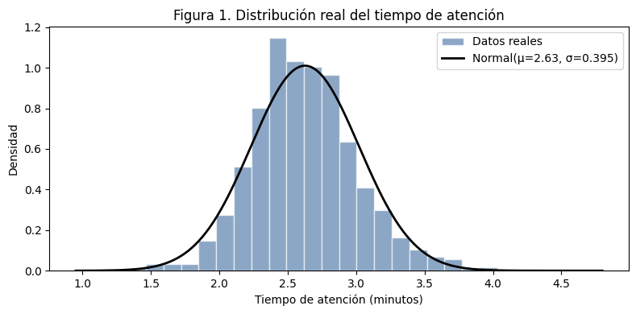
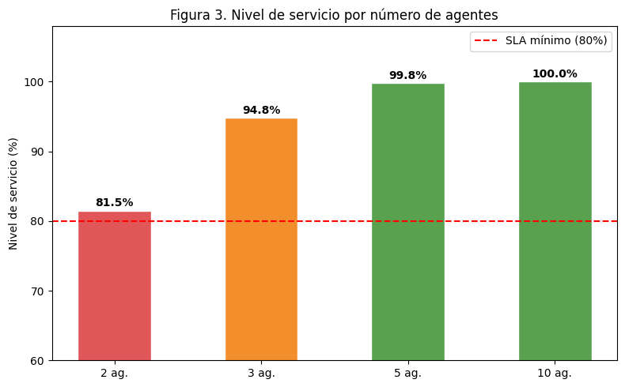
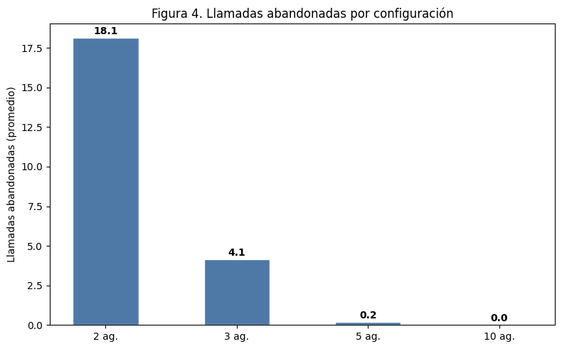
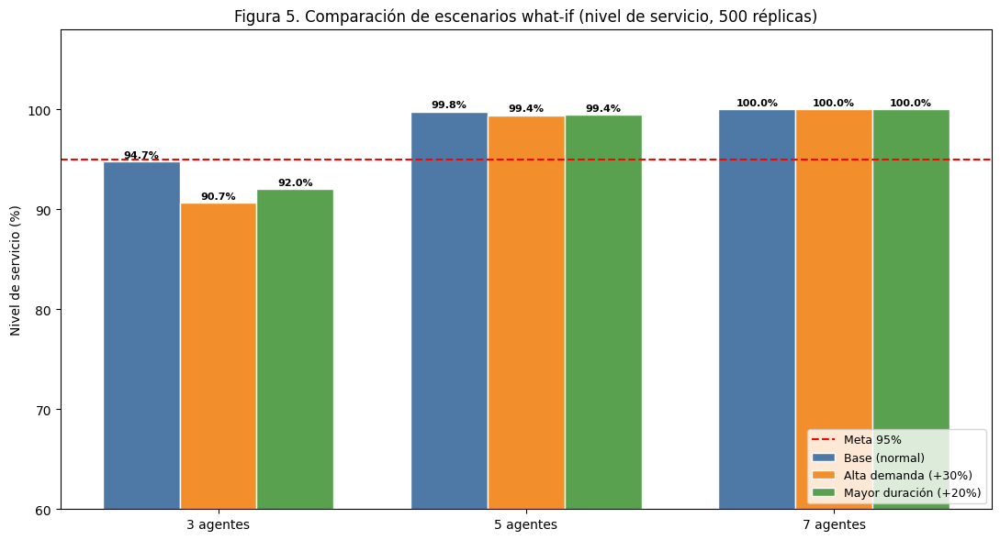
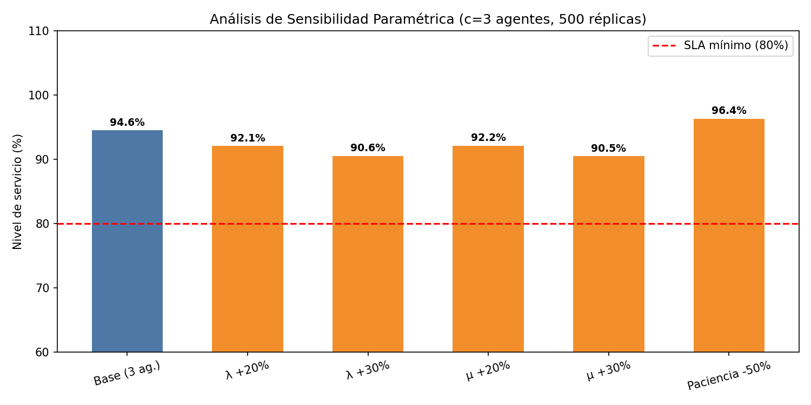

<div align="center">

# 📞 Simulación Monte Carlo para la Optimización de un Call Center

**¿Cuántos agentes necesita realmente un Call Center?**
Simulación de eventos discretos calibrada con 248 373 llamadas reales.


</div>

---

## 📌 Resumen

El Call Center analizado tiene una **tasa de abandono real del 10.93 %** y un tiempo de espera promedio de **3.87 min**. Este proyecto construye un modelo Monte Carlo (llegadas exponenciales, atención normal truncada, paciencia exponencial, cola FIFO con *c* agentes) para encontrar la dotación que cumple el SLA sin sobredimensionar.

> **Conclusión:** con **5 agentes** el nivel de servicio es **99.8 %** con menos de 1 abandono por jornada, y se mantiene en **99.4 %** ante un aumento de demanda del 30 %.

## 🗂️ Contenido

| Archivo / carpeta | Descripción |
|---|---|
| [`Jhojan_Modelado_y_Simulacion.ipynb`](Jhojan_Modelado_y_Simulacion.ipynb) | Modelo principal, escenarios base y what-if, gráficas |
| [`verificacion_VV.ipynb`](verificacion_VV.ipynb) | Verificación y validación (genera `evidencias_VV/`) |
| [`Call_Center_Data.csv`](Call_Center_Data.csv) | Dataset de entrada (1 251 registros) |
| [`informe/`](informe) | Informe técnico y póster en PDF |
| [`evidencias_VV/`](evidencias_VV) | Trazabilidad, pruebas de extremos, validación y sensibilidad |
| [`img/`](img) | Figuras usadas en este README |

## ⚙️ Modelo

```
Llegadas (Exp, λ) ──► Cola FIFO ──► c agentes en paralelo ──► Llamada atendida
                          │             (Normal truncada ≥ 0.1 min)
                          └──► Abandono si espera > paciencia (Exp, media 3 min)
```

| Parámetro | Valor | Distribución |
|---|---|---|
| λ (llegadas) | ≈ 0.414 llam/min (~198 por turno) | Exponencial (inter-llegadas) |
| Tiempo de atención | μ = 2.63 min, σ = 0.395 min | Normal truncada (≥ 0.1) |
| Paciencia del cliente | media = 3 min | Exponencial |
| Turno simulado | 480 min (8 h) | — |
| SLA | 80 % de llamadas atendidas en < 20 s | — |

**Supuestos:** agentes homogéneos, una sola cola sin prioridades, sin descansos ni variación intradiaria de la demanda.



## 📊 Resultados

### Escenario base (500 réplicas por configuración)

| Agentes | Atendidas | Abandonadas | Espera (min) | Nivel de servicio | Estado |
|:---:|:---:|:---:|:---:|:---:|---|
| 2 | 180.5 | 17.9 | 0.224 | 81.5 % | 🔴 Insuficiente |
| 3 | 194.4 | 4.1 | 0.052 | 95.0 % | 🟠 Aceptable |
| **5** | **197.4** | **0.1** | **0.002** | **99.8 %** | 🟢 **Óptimo** |
| 10 | 198.0 | 0.0 | 0.000 | 100 % | ⚪ Sobredimensionado |

<p align="center">
  
  
</p>

### Escenarios *what-if*

Los escenarios se implementan como factores multiplicativos sobre λ y μ.

| Escenario | Factor λ | Factor μ | 3 agentes | 5 agentes | 7 agentes |
|---|:---:|:---:|:---:|:---:|:---:|
| Base | ×1.00 | ×1.00 | 95.0 % | 99.8 % | 100 % |
| Alta demanda (+30 %) | ×1.30 | ×1.00 | 90.5 % | 99.4 % | 100 % |
| Mayor duración (+20 %) | ×1.00 | ×1.20 | 91.9 % | 99.5 % | 100 % |



> Los valores provienen del informe (`informe/`). Al re-ejecutar los notebooks pueden variar levemente por la aleatoriedad de la simulación.

## ✅ Verificación y validación

| Prueba | Resultado |
|---|---|
| **VV-01** · *c* = 0 agentes → 0 atendidas, 100 % abandono | ✓ Aprobada |
| **VV-02** · *c* = 1000 agentes → 0 abandonos, SL = 100 % | ✓ Aprobada |
| **VV-03** · Monotonicidad: más agentes → menos abandonos | ✓ Aprobada |
| **Validación** · abandono real 10.93 % vs. modelo (2 agentes) 9.16 % | ✓ Diferencia 1.77 pp |

Evidencias completas en [`evidencias_VV/`](evidencias_VV): [trazabilidad](evidencias_VV/trazabilidad.md) · [pruebas de extremos](evidencias_VV/pruebas_extremos.txt) · [validación](evidencias_VV/validacion_datos_reales.txt).

### Sensibilidad paramétrica (3 agentes)



Aumentar λ o μ reduce el nivel de servicio. Reducir la paciencia un 50 % lo **aumenta** (94.6 % → 96.4 %): los clientes impacientes abandonan y sus esperas no se contabilizan, de modo que las llamadas efectivamente atendidas esperan menos. Es un efecto de cómo se define el KPI, no un error del código.

## 🚀 Cómo ejecutarlo

```bash
git clone https://github.com/JhojanGomez448/simulacion-montecarlo-callcenter.git
cd simulacion-montecarlo-callcenter
pip install -r requirements.txt
jupyter notebook
```

1. Ejecuta `Jhojan_Modelado_y_Simulacion.ipynb` (*Run All*) para los resultados y gráficas.
2. Ejecuta `verificacion_VV.ipynb` para regenerar `evidencias_VV/`.

Ambos notebooks esperan `Call_Center_Data.csv` en la misma carpeta. Semilla `42` y `500` réplicas por configuración.

## 🔭 Limitaciones y trabajo futuro

- Modelar la demanda por franjas horarias con un proceso de Poisson no homogéneo.
- Incorporar enrutamiento por habilidades y agentes heterogéneos.
- Optimizar la dotación minimizando el costo total (nómina + costo de abandono).

## 👤 Autor

**Jhojan Raul Zambrano Gomez** · Modelado y Simulación
Fundación Universitaria Compensar · Docente: Alexander Reyes Moreno · Bogotá, Colombia, mayo de 2026
